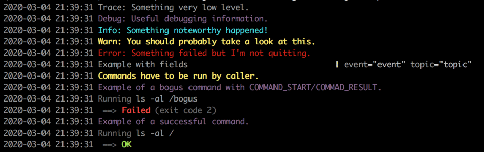

cwformatter
=====

[![Go Report Card][goreport-img]][goreport-url]
[![Build status][build-img]][build-url]
[![Coverage report][cover-img]][cover-url]
[![GoDoc][godoc-img]][godoc-url]
[![License: WTFPL][license-img]][license-url]

Package cwformatter is a simple [lorus](https://github.com/sirupsen/logrus)
formatter to display color logs (if possible, no color is used if output is
piped) to the terminal.

# Example

```go
import (
	cwformatter "github.com/renard/go-cwformatter"
	log 	"github.com/sirupsen/logrus"
)

func ExampleLog() {
	l := log.New()
	l.Out = os.Stdout
	f := cwformatter.NewFormatter()
	l.Formatter = f

	l.SetLevel(log.TraceLevel)
	// l.SetFormatter(new(ColorFormatter))
	l.Trace("Trace: Something very low level.")
	l.Debug("Debug: Useful debugging information.")
	l.Info("Info: Something noteworthy happened!")
	l.Warn("Warn: You should probably take a look at this.")
	l.Error("Error: Something failed but I'm not quitting.")

	l.WithFields(log.Fields{
		"event": "event",
		"topic": "topic",
	}).Trace("Example with fields")

	l.Warning("Commands have to be run by caller.")

	l.Debug("Example of a bogus command with COMMAND_START/COMMAD_RESULT.")
	l.WithFields(log.Fields{
		"COMMAND_START": "ls -al /bogus",
	}).Info("")
	l.WithFields(log.Fields{
		"COMMAND_RESULT": 2,
	}).Error("")

	l.Debug("Example of a successful command.")
	l.WithFields(log.Fields{
		"COMMAND_START": "ls -al /",
	}).Info("")
	l.WithFields(log.Fields{
		"COMMAND_RESULT": 0,
	}).Info("")
}
```

<p align="center">
  
</p>

# License

Copyright © 2020 Sébastien Gross <seb•ɑƬ•chezwam•ɖɵʈ•org> 

This program is free software. It comes without any warranty, to the extent
permitted by applicable law. You can redistribute it and/or modify it under
the terms of the Do What The Fuck You Want To Public License, Version 2, as
published by Sam Hocevar. See http://sam.zoy.org/wtfpl/COPYING for more
details.


[goreport-img]: https://goreportcard.com/badge/github.com/renard/go-cwformatter?branch=master
[goreport-url]: https://goreportcard.com/report/github.com/renard/go-cwformatter?branch=master
[build-img]: https://travis-ci.org/renard/go-cwformatter.svg?branch=master
[build-url]: https://travis-ci.org/renard/go-cwformatter
[cover-img]: https://coveralls.io/repos/github/renard/go-cwformatter/badge.svg?branch=master
[cover-url]: https://coveralls.io/github/renard/go-cwformatter?branch=master
[godoc-img]: https://godoc.org/github.com/renard/go-cwformatter?status.svg
[godoc-url]: https://godoc.org/github.com/renard/go-cwformatter
[license-img]: https://img.shields.io/badge/License-WTFPL-brightgreen.svg
[license-url]: http://www.wtfpl.net/about/
